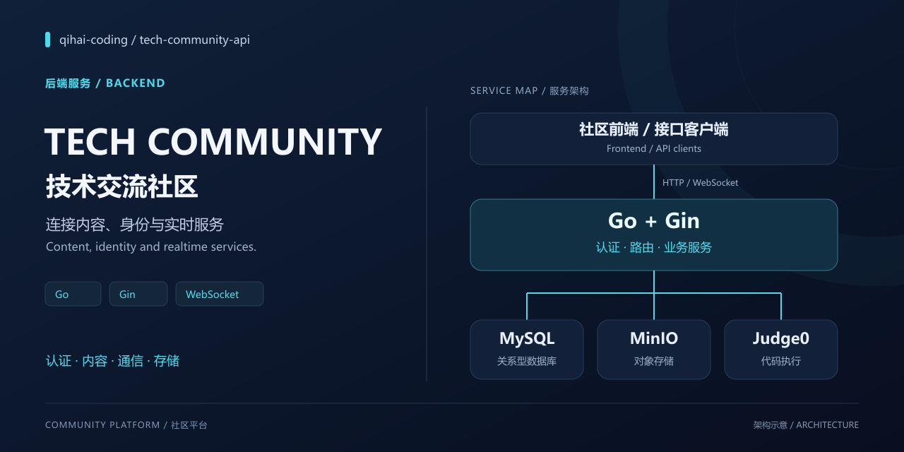
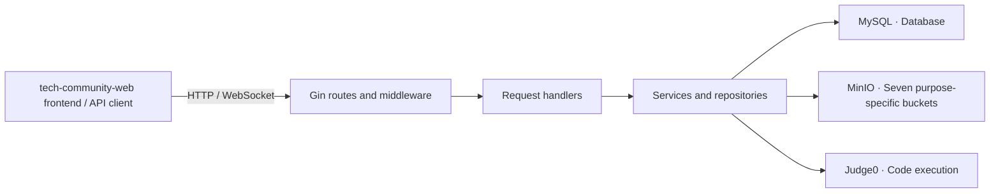

[简体中文（Chinese）](README.md) · English · [Frontend repository](https://github.com/qihai-coding/tech-community-web)

# Tech Community · Backend Service



A Go and Gin backend for community authentication, content management, realtime chat, private messages, resource storage and code execution. Designed to work with the [tech-community-web frontend](https://github.com/qihai-coding/tech-community-web).

[Features](#features) · [Architecture](#architecture) · [Quick start](#quick-start) · [API entry points](#api-entry-points) · [Runtime notes](#runtime-notes)

## Features

| Area | Capabilities implemented in the source |
| --- | --- |
| Accounts and access | Registration, login, JWT authentication, profiles, password changes, administrator access control and activity history |
| Articles | Articles, categories, tags, comments, likes and reports |
| Live chat | WebSocket connections, online users, broadcasts, message history and HTTP fallback endpoints |
| Private messages | Conversations, unread counts, message delivery and realtime notifications |
| Resource storage | Resource categories and comments, image uploads, chunked uploads, upload status and merging; seven purpose-specific buckets |
| Online coding | Judge0 execution, code snippets, execution records and share links |
| Operations and insights | Cumulative, daily, realtime, user and API statistics; health endpoints, structured logging, rate limiting and in-process caching |

## Technology

| Layer | Libraries and responsibilities |
| --- | --- |
| Service and communication | Go, Gin and Gorilla WebSocket |
| Storage | MySQL, the standard `database/sql` interface and MinIO |
| Identity and configuration | JWT, bcrypt password hashing and YAML configuration |
| Logging and execution | Zap structured logging and an external Judge0 service |

Dependency versions are listed in [go.mod](go.mod). Caches and online connection management run inside the service process.

## Architecture



Startup connects to the database, initializes storage buckets, assembles services and checks administrator accounts. Prepare the database and object storage beforehand. Online execution additionally needs a reachable Judge0 service compatible with the language IDs used by this code.

## Quick start

### 1. Prepare services

- Go **1.22.3 or later**, matching the module's declared minimum.
- MySQL with support for stored procedures and the `ngram` full-text parser used by the initialization script. The initialization account needs database, table, index and stored-procedure creation permissions.
- A reachable MinIO service. Application credentials need permission to check and create all seven buckets and configure their policies.
- A Judge0 service if online code execution is needed. The public endpoint in the repository does not guarantee availability or quota.

### 2. Fetch the code and initialize the database

```sh
git clone https://github.com/qihai-coding/tech-community-api.git
cd tech-community-api
go mod download
mysql -h 127.0.0.1 -u root -p -e "source sql/init_all_tables.sql"
```

This database command targets a local MySQL instance; change the host for a remote service. Enter the password at the prompt. The script creates and selects the **`hub`** database, which must match the application configuration. Start with an empty development database. `sql/clear_all_data.sql` clears data and is not part of installation.

### 3. Create local configuration

```sh
cp config.yaml config.dev.yaml
```

In PowerShell, `Copy-Item config.yaml config.dev.yaml` is also supported. `APP_ENV` defaults to `dev`; the loader selects `config.dev.yaml` first and falls back to `config.yaml` when absent. The local development file is ignored by Git.

Edit **`config.dev.yaml`** to replace the existing service addresses and credentials:

| Setting | Local development value |
| --- | --- |
| `server.host` / `server.port` / `server.mode` | `127.0.0.1` / `3001` / `debug` |
| `database.host` / `database.port` | Your database address, for example `127.0.0.1` / `3306` |
| `database.username` / `database.password` | Application credentials with access to `hub` |
| `database.database` | `hub`, matching the initialization script |
| `jwt.secret_key` | Your own high-entropy random secret; replace the checked-in value |
| `minio.endpoint` | Object storage API address, such as `127.0.0.1:9000`, without a URL scheme |
| `minio.access_key_id` / `minio.secret_access_key` | Your own object storage credentials |
| `minio.use_ssl` | Whether storage uses TLS; match the service configuration |
| `public_base_url` in all seven `bucket_` sections | Each bucket's URL, such as `http://127.0.0.1:9000/user-avatars`; URLs used by the browser must be reachable from that browser |
| `admin.usernames` / `admin.default_password` | Your administrator username list and a strong initial password |
| `cors.allow_origins` | Frontend origins, for example `["http://localhost:3000", "http://127.0.0.1:3000"]` |
| `code_executor.api_url` | Base URL of a reachable Judge0 service |

The seven buckets hold avatars, resource chunks, resource previews, document images, article images, temporary files and system assets. The current configuration makes the temporary bucket private.

Supported environment variables override their corresponding settings after the file is loaded. These include `SERVER_HOST`, `SERVER_PORT`, `SERVER_MODE`, `DB_HOST`, `DB_PORT`, `DB_USERNAME`, `DB_PASSWORD`, `DB_DATABASE`, `JWT_SECRET`, `MINIO_ENDPOINT`, `MINIO_ACCESS_KEY`, `MINIO_SECRET_KEY`, `MINIO_USE_SSL` and `CODE_EXECUTOR_API_URL`. See the [configuration loader](internal/config/config.go) for the complete set. The application does not automatically load a `.env` file.

Edit CORS origins, administrator settings and bucket URLs in the local configuration file. Although a configuration comment mentions `CORS_ORIGINS`, no corresponding environment override is currently implemented.

### 4. Start and check

Run from the repository root:

```sh
go run .
```

In another terminal:

```sh
curl http://127.0.0.1:3001/health
```

A successful database check returns `{"status":"healthy"}`. You can also open that URL in a browser. A successful `/health` response does not validate object storage transfers, every business endpoint or code execution.

Then follow the [frontend setup instructions](https://github.com/qihai-coding/tech-community-web/blob/main/README.en.md#quick-start).

## API entry points

| Entry point | Purpose and access |
| --- | --- |
| `/health`, `/ready`, `/live` | Health, readiness and liveness; the first two check the database |
| `/api/auth/register`, `/api/auth/login` | Registration and login |
| `/api/auth/me`, `/api/user/*` | Authenticated profile operations and user queries |
| `/api/articles*`, `/api/comments/*` | Authenticated article and comment operations |
| `/api/chat/ws`, `/api/chat/*` | Authenticated realtime connection and chat endpoints |
| `/api/conversations*`, `/api/messages/send` | Authenticated private messages |
| `/api/resources*`, `/api/upload/*` | Authenticated resource operations and chunked uploads |
| `/api/code/*` | Code execution and snippet management; the share-token lookup is public |
| `/api/statistics/*`, `/api/location/distribution`, `/api/cumulative-stats`, `/api/daily-metrics`, `/api/realtime-metrics` | Administrator statistics |

This is an entry-point overview, not a complete API contract. See the [route definitions](internal/routes/routes.go) for request methods, authentication requirements and handlers.

## Project structure

```text
main.go             Entry point and lifecycle
internal/
├── bootstrap/      Service assembly and administrator initialization
├── config/         Configuration loading and validation
├── routes/         API routes
├── middleware/     Authentication, CORS, limits, logs and metrics
├── handlers/       Requests and realtime connections
├── services/       Business services, repositories, storage and execution
├── models/         Data models
└── utils/          Helpers and in-process infrastructure
sql/                Database initialization and data cleanup scripts
pyData/             Development data generators
scripts/            Maintenance utilities
docs/assets/        Repository cover and editable vector source
```

## Runtime notes

- Administrator access is determined by the configured username list. The initializer logs the initial password of a newly created administrator. Restrict log access and change that password after first login. See the [initializer](internal/bootstrap/init_admin.go).
- The companion frontend's home-page content notifications currently use `/api/ws`, while this backend registers `/api/chat/ws`. This notification path needs alignment and integration testing; the chat service uses the latter.
- Uploads and image display require the application and browser to reach the appropriate storage addresses. Update each bucket URL when changing the storage host.
- Implemented rate limits, caches and metrics are not capacity benchmarks. The cover is an architecture illustration; deployment, business workflows and performance need validation in the target environment.

## Feedback and license

Report problems or suggest improvements through [Issues](https://github.com/qihai-coding/tech-community-api/issues), including reproduction steps and logs with passwords, tokens and personal information removed.

Licensed under the [MIT License](LICENSE). Copyright `2026 qihai-coding`. Third-party dependencies retain their own licenses.
