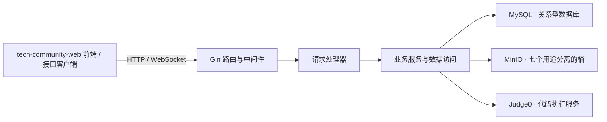

简体中文 · [English（英文）](README.en.md) · [前端仓库](https://github.com/qihai-coding/tech-community-web)

# Tech Community · 技术交流社区后端


为技术交流社区提供身份认证、内容管理、实时聊天、私信、资源存储和代码执行接口。使用 Go（编程语言）与 Gin（网络服务框架），与 [tech-community-web 前端](https://github.com/qihai-coding/tech-community-web)配套运行。

[功能概览](#功能概览) · [系统架构](#系统架构) · [快速开始](#快速开始) · [接口入口](#接口入口) · [运行说明](#运行说明)

## 功能概览

| 模块 | 代码中实现的能力 |
| --- | --- |
| 账号与权限 | 注册、登录、JWT（令牌认证）、资料维护、密码修改、管理员访问控制与历史记录 |
| 文章社区 | 文章、分类、标签、评论、点赞与举报 |
| 实时聊天 | WebSocket（双向实时通信）连接、在线用户、消息广播、历史消息与普通请求降级接口 |
| 私信 | 会话、未读计数、消息发送与实时通知 |
| 资源存储 | 资源分类与评论、图片上传、分片上传、上传状态与合并；按用途分离的七个存储桶 |
| 在线编程 | 通过 Judge0（代码执行服务）执行代码，管理代码片段、执行记录与分享链接 |
| 统计与运维 | 累计、每日、实时、用户与接口统计；健康检查、结构化日志、限流与内存缓存 |

## 技术栈

| 层次 | 技术与用途 |
| --- | --- |
| 服务与通信 | Go、Gin、Gorilla WebSocket（实时通信库） |
| 数据存储 | MySQL（关系型数据库）、`database/sql`（标准数据库接口）、MinIO（对象存储） |
| 身份与配置 | JWT（令牌认证）、bcrypt（密码哈希）、YAML（结构化配置格式） |
| 日志与执行 | Zap（结构化日志库）、Judge0（外部代码执行服务） |

依赖版本见 [go.mod](go.mod)。缓存与在线连接管理位于服务进程内。

## 系统架构



服务启动时连接数据库、初始化存储桶、装配业务服务并检查管理员账号。数据库与对象存储需要提前准备；在线代码执行还需要可访问且兼容当前语言编号的 Judge0 服务。

## 快速开始

### 1. 准备服务

- Go **1.22.3 或更高版本**，对应模块声明的最低版本。
- MySQL 数据库。初始化脚本使用存储过程和 `ngram`（多字符切分）全文索引解析器，数据库需支持这些能力；初始化账号需具备建库、建表、建索引和创建存储过程的权限。
- 可访问的 MinIO 服务。应用凭据需具备检查、创建七个存储桶及设置桶策略的权限。
- 如需在线执行代码，准备 Judge0 服务；仓库中的公共服务地址不构成可用性或配额保证。

### 2. 获取代码与初始化数据库

```sh
git clone https://github.com/qihai-coding/tech-community-api.git
cd tech-community-api
go mod download
mysql -h 127.0.0.1 -u root -p -e "source sql/init_all_tables.sql"
```

数据库命令适用于位于本机的 MySQL 服务，远程数据库需替换主机。密码通过提示输入。脚本创建并使用 **`hub`** 数据库，配置名称需与其一致；请先在空的开发数据库执行。`sql/clear_all_data.sql` 是清理数据脚本，不属于安装步骤。

### 3. 创建本地配置

```sh
cp config.yaml config.dev.yaml
```

在 PowerShell（命令行环境）中也可使用 `Copy-Item config.yaml config.dev.yaml`。默认 `APP_ENV=dev`，程序优先读取 `config.dev.yaml`，不存在时读取 `config.yaml`；本地开发配置已被版本管理忽略。

编辑 **`config.dev.yaml`**，替换原配置中的服务地址和凭据：

| 配置项 | 本地开发设置 |
| --- | --- |
| `server.host` / `server.port` / `server.mode` | `127.0.0.1` / `3001` / `debug` |
| `database.host` / `database.port` | 可访问的数据库地址，例如 `127.0.0.1` / `3306` |
| `database.username` / `database.password` | 有权访问 `hub` 的应用账号与密码 |
| `database.database` | `hub`，与初始化脚本一致 |
| `jwt.secret_key` | 自行生成的高强度随机密钥，不沿用仓库中的值 |
| `minio.endpoint` | 对象存储接口地址，例如 `127.0.0.1:9000`，不带协议前缀 |
| `minio.access_key_id` / `minio.secret_access_key` | 自有对象存储凭据 |
| `minio.use_ssl` | 是否使用加密连接，与存储服务配置一致 |
| 七个 `bucket_` 配置节的 `public_base_url` | 对应桶的访问地址；例如 `http://127.0.0.1:9000/user-avatars`，供浏览器使用的地址必须能被浏览器访问 |
| `admin.usernames` / `admin.default_password` | 自定管理员用户名列表与强初始密码 |
| `cors.allow_origins` | 允许的前端来源，例如 `["http://localhost:3000", "http://127.0.0.1:3000"]` |
| `code_executor.api_url` | 可访问的 Judge0 服务根地址 |

七个桶分别用于头像、资源分片、资源预览、文档图片、文章图片、临时文件与系统静态文件。临时桶在现有配置中为私有桶。

支持的环境变量会在文件加载后覆盖对应配置，包括 `SERVER_HOST`、`SERVER_PORT`、`SERVER_MODE`、`DB_HOST`、`DB_PORT`、`DB_USERNAME`、`DB_PASSWORD`、`DB_DATABASE`、`JWT_SECRET`、`MINIO_ENDPOINT`、`MINIO_ACCESS_KEY`、`MINIO_SECRET_KEY`、`MINIO_USE_SSL` 和 `CODE_EXECUTOR_API_URL` 等。完整范围以[配置加载器](internal/config/config.go)为准；程序不会自动加载 `.env` 文件。

跨域来源、管理员设置和各桶访问地址应直接编辑本地配置文件。配置注释提及的 `CORS_ORIGINS` 当前没有对应的环境变量覆盖实现。

### 4. 启动与检查

在仓库根目录执行：

```sh
go run .
```

在另一个终端检查：

```sh
curl http://127.0.0.1:3001/health
```

数据库检查通过时返回 `{"status":"healthy"}`。也可直接在浏览器中打开该地址。`/health` 检查成功并不代表对象存储读写、所有业务接口或代码执行均已通过验证。

然后按[前端启动说明](https://github.com/qihai-coding/tech-community-web#快速开始)启动社区界面。

## 接口入口

| 入口 | 用途与访问条件 |
| --- | --- |
| `/health`、`/ready`、`/live` | 健康、就绪与存活检查；前两者检查数据库 |
| `/api/auth/register`、`/api/auth/login` | 注册与登录 |
| `/api/auth/me`、`/api/user/*` | 已登录用户的个人资料与用户查询 |
| `/api/articles*`、`/api/comments/*` | 文章与评论，需认证 |
| `/api/chat/ws`、`/api/chat/*` | 实时连接与聊天接口，需认证 |
| `/api/conversations*`、`/api/messages/send` | 私信，需认证 |
| `/api/resources*`、`/api/upload/*` | 资源与分片上传，需认证 |
| `/api/code/*` | 代码执行与片段管理；分享令牌查询入口允许公开访问 |
| `/api/statistics/*`、`/api/location/distribution`、`/api/cumulative-stats`、`/api/daily-metrics`、`/api/realtime-metrics` | 管理员统计 |

这是入口概览，不是完整接口契约。具体请求方法、认证条件和处理器以[路由定义](internal/routes/routes.go)为准。

## 项目结构

```text
main.go             程序入口与生命周期
internal/
├── bootstrap/      服务装配与管理员初始化
├── config/         配置加载和校验
├── routes/         接口路由
├── middleware/     认证、跨域、限流、日志和统计
├── handlers/       请求处理与实时连接
├── services/       业务服务、数据访问、存储和代码执行
├── models/         数据模型
└── utils/          通用工具与进程内基础设施
sql/                数据库初始化与数据清理脚本
pyData/             开发数据生成工具
scripts/            维护工具
docs/assets/        仓库展示封面与可编辑矢量源图
```

## 运行说明

- 管理员权限依据配置的用户名列表判定。管理员初始化流程会将新建账号的初始密码写入日志；请限制日志访问，并在首次登录后修改密码。相关行为见[初始化实现](internal/bootstrap/init_admin.go)。
- 当前配套前端的首页内容通知使用 `/api/ws`，后端实际注册 `/api/chat/ws`；该通知链路需对齐并联调，聊天室使用后者。
- 上传与图片展示需要应用和浏览器都能访问相应的存储地址；配置存储服务地址时，也要同步更新各桶的访问地址。
- 已实现的限流、缓存和指标不等于经过容量验收。封面为架构示意；完整部署、业务流程与性能需要在实际环境验证。

## 反馈与许可

问题与改进建议请提交至 [Issues（问题反馈）](https://github.com/qihai-coding/tech-community-api/issues)，附上复现步骤和已移除密码、令牌及个人信息的日志。

本项目采用 [MIT（宽松开源许可证）](LICENSE)，版权归属为 `2026 qihai-coding`。第三方依赖仍遵循各自许可证。
